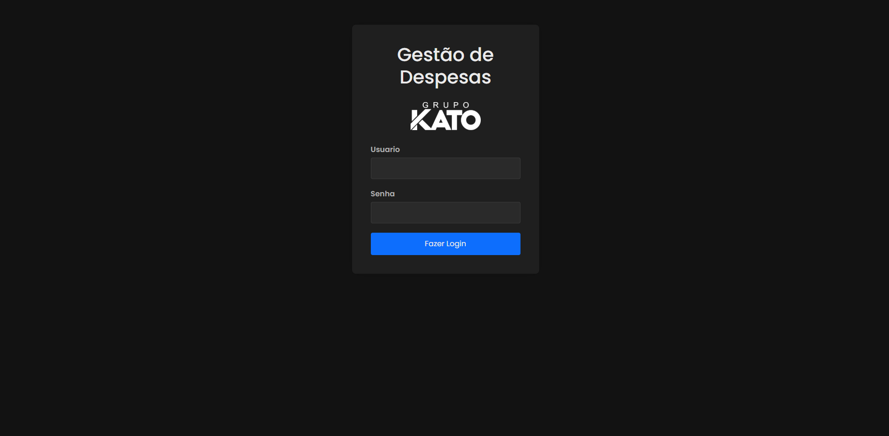
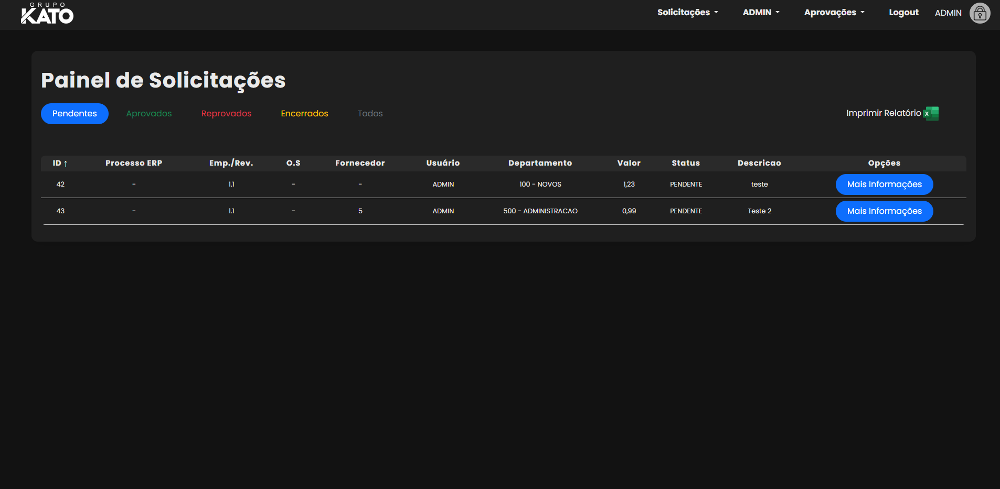
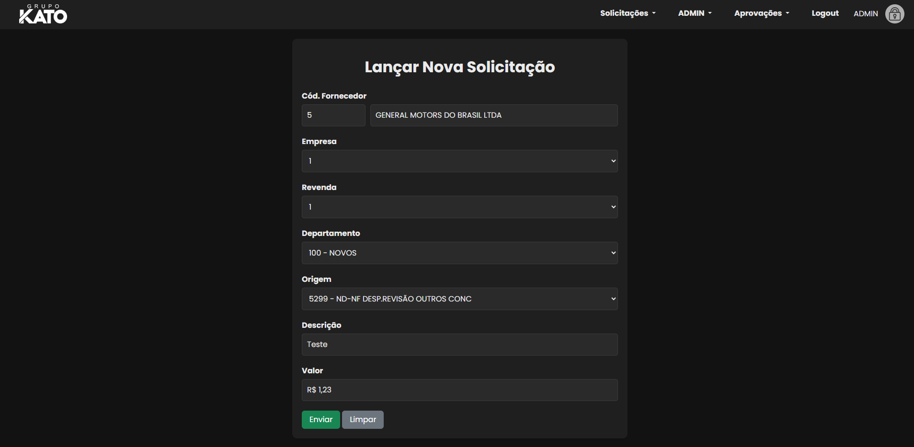

# 💼 Gestão de Despesas Empresariais


Aplicação **open source** desenvolvida em **Python + Flask**, com banco de dados **Oracle** e servidor **Waitress** configurado para produção.  
O sistema permite gerenciar despesas empresariais, controlar aprovações e fornecer uma visão clara para gestores e diretoria.

---

## 🚀 Funcionalidades

- 📌 Cadastro e gerenciamento de despesas  
- ✅ Fluxo de **aprovação/rejeição** de solicitações  
- 🔐 Controle de acesso por **nível de usuário** (Administrador, Gerente, Diretoria)  
- 📊 Relatórios simplificados para acompanhamento financeiro  
- ⚡ Deploy pronto para produção usando **Waitress**  

---

## 📸 Screenshots

> *(Adicione imagens reais do seu projeto na pasta `docs/` e troque os exemplos abaixo)*





---

## 🛠 Tecnologias utilizadas

- **Backend:** Python, Flask  
- **Banco de Dados:** OracleDB (via `oracledb`)  
- **Servidor de Produção:** Waitress  
- **Frontend:** HTML, CSS, Bootstrap (templates Jinja2)  

---

## 📦 Como rodar o projeto localmente

1. Clone o repositório:
   ```bash
   git clone https://github.com/joao-v-marques/gestao_despesas.git
   cd gestao_despesas

2. Crie e ative um ambiente virtual:
    python -m venv venv
    source venv/bin/activate   # Linux/Mac
    venv\Scripts\activate      # Windows

3. Instale as dependências:
    pip install -r requirements.txt

4. Configure as variáveis de ambiente (exemplo em .env.example):
    SECRET_KEY=chave_segura

5. Configure seu arquivo configs.json na pasta database com as seguintes informações: (Banco Oracle)
    {
        "banco": {
            "user" : "User do seu banco",
            "pass" : "Senha do seu banco",
            "dns" : "DNS de conexão do seu banco",
            "instant_client" : "Caminho do seu arquivo instantclient"
        }
    }

6. Troque as tabelas de exemplo nas rotas e modelos para as tabelas reais do seu projeto:

7. Execute a aplicação:
        python app.py
    Ou execute em produção:
        waitress-serve --port=8080 app:app


---

📄 Licença

Este projeto está licenciado sob a MIT License.

---

⭐ Inspire-se

Se este projeto te ajudou ou chamou atenção, deixe uma ⭐ no repositório!